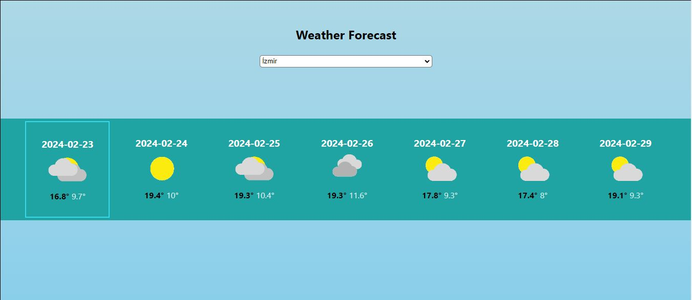

<h1>Weather Forecast App</h1>
<p>The purpose of this application is to show users 1-week weather forecasts according to the city they choose. According to the city selected by the user, the coordinates of the city are taken and the relevant coordinate parameter is transmitted to the API and the weather forecast for a week is shown to the user accordingly. The user's current day's forecast is displayed in the frame</p>
<h2>Start and Run</h2>

In root directory,
```
`npm install` -- Install dependencies
`npm start` -- starts the application

 Open http://localhost:3000 to view it in your browser.

```
<div align="center">
<br/><br/><br/><br/>      

<br/><br/><br/><br/>    
</div>
